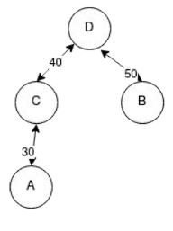

# ChainMotor

## Description

ChainMotor dont le nom français est Moteur de châine, permet de manipuler de filtrer/transformer un arbre lexicographique réalisé ultérieurement par le module [ScoreEngine]().
Cette transformation va permettre d’obtenir un arbre recouvrant maximal, c’est-à-dire un arbre qui élimine les branches (arêtes) qui ne sont pas nécessaires.
Le but est de réduire la taille de l’arbre pour faciliter la recherche de la meilleure solution (le meilleur chemin) dans l’arbre.

### But du jeu

Chaque joueur reçoit un mot de départ et un mot cible et propose des mots proches afin de créer une **chaîne de mots similaires** pour relier le mot de départ au mot cible.
Le score d’une chaîne de mots correspond au score de similarité de son **maillon le plus faible** : peu importe la longueur de la chaîne, le but est que chaque mot ressemble autant que possible au précédent.

## Prérequis

- Java 21 ou supérieur
- Maven 3.9.0 ou supérieur

## Informations complémentaires

### Format de fichier d'entrée et de sortie :

- Fichier d'entrée de **ScoreEngine** : `game_data_[pseudo].txt` :
    - La 1ère ligne contient uniquement "Mots de départ :".
    - La 2ème et 3ème lignes contiennent sur chaque ligne : le mot de départ ou d'arrivé suivit de leur offset (position du mot dans l'arbre lexicographique, entier) séparé par une virgule.
    - La 4ème ligne contient uniquement "Liste des mots :".
    - Les lignes suivantes contiennent les mots du jeu selon le format suivant : "mot, offset: _offset_".
    - Après la liste des mots, il y a une ligne qui contient uniquement "Distance entre les mots :".
    - Les lignes suivantes contiennent les distances entre les mots du jeu selon le format suivant : "mot1, mot2, distance: _similarité_". (la similarité est un nombre à virgule flottante entre 0 et 100).

- Fichier d'entrée de **ChainMotor** : `mst_[pseudo].txt` :
    - La 1ère ligne contient uniquement "MaximumSpanningTree :" pour indiquer le nom de la structure de données.
    - Les lignes suivantes vont donc contenir les différents champs de la structure de données.
    - La 2ème ligne contient le mot de départ de la façon suivante : "startWord : _mot_".
    - La 3ème ligne contient le mot d'arrivé de la façon suivante : "endWord : _mot_".
    - La 4ème ligne contient uniquement "edgesMST :" pour indiquer le début de la liste des arêtes du MST.
    - Les lignes suivantes contiennent les arêtes du MST selon le format suivant : "mot1, mot2, distance: _similarité_".
    - Ensuite, il y a une ligne qui contient uniquement "bannedWords :" pour indiquer le début de la liste des mots bannis.
    - Les lignes suivantes contiennent les mots bannis selon le format suivant : "mot".
    - Enfin, il y a une ligne qui contient uniquement "EOF" pour indiquer la fin du fichier.

- Fichier de sortie de **ChainMotor** : `best_path_[pseudo].txt` :
    - La 1ère ligne contient uniquement "BestPath :" pour indiquer le nom de la structure de données.
    - Les lignes suivantes vont donc contenir les différents champs de la structure de données.
    - La 2ème ligne contient le mot de départ de la façon suivante : "startWord : _mot_".
    - La 3ème ligne contient le mot d'arrivé de la façon suivante : "endWord : _mot_".
    - La 4ème ligne contient uniquement "bestPathEdges :" pour indiquer le début de la liste des arêtes du meilleur chemin.
    - Les lignes suivantes contiennent les arêtes du meilleur chemin selon le format suivant : "mot1, mot2, distance: _similarité_".
    - Ensuite, il y a une ligne qui contient "MinimumSimilarity : _similarité_" pour indiquer la similarité minimale du meilleur chemin.
    - Enfin, il y a une ligne qui contient uniquement "EOF" pour indiquer la fin du fichier.

### Termes importants

### Structure de données

#### MaximumSpanningTree : Classe représentant l'arbre recouvrant maximal.

- `startWord` : Mot de départ de la partie.
- `endWord` : Mot d'arrivé/cible de la partie.
- `edgesMST` : Liste des arêtes du MST.
- `bannedWords` : Liste des mots bannis.

#### Word : Record représentant un mot.

- `word` : Mot.

#### Edge : Record représentant une arête.

- `sourceWord` : Mot source de l'arête.
- `similarity` : Similarité entre les mots source et cible.
- `targetWord` : Mot cible de l'arête.

#### BestPath : Classe représentant le meilleur chemin.

- `maximumSpanningTree` : MST de la partie.
- `bestPathEdges` : Liste des arêtes du meilleur chemin.
- `minimumSimilarity` : Similarité minimale du meilleur chemin.

#### FileLine : Enumération représentant les différentes lignes d'un fichier.

#### Main : Classe principale du programme.

#### Test : Classe de test du programme.

Arbre de test utilisé :

Vous pouvez retrouver les étapes de création de l'arbre dans le fichier `res/Arbre-partie-v2.pdf`.

### JavaDoc

La JavaDoc du projet est disponible dans le dossier `doc` à la racine du projet.
Des documents complémentaire tel que le sujet et les consignes du projet sont disponibles dans le dossier `res` à la racine du projet.

## Auteurs

### [@Mariya Constantine Cédric](https://github.com/cedric-mc/)

### Co-auteur :

#### [@Ba Mamadou](https://github.com/mamadou186/)

#### [@Riche Abdelrahim](https://github.com/Abdelrahim-Riche/)

#### [@Sousa Vincent](https://github.com/VincentSousa/)

#### [@Zemouche Yacine](https://github.com/Yacine771/)